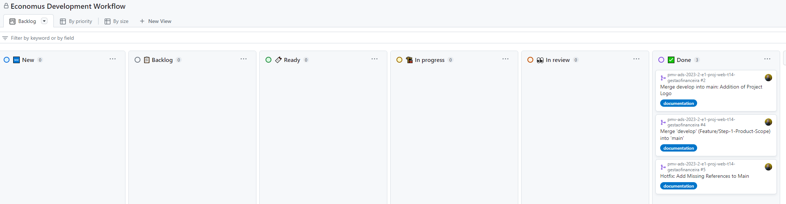

# Metodologia

### Gerenciamento de Projeto

A metodologia ágil escolhida para o desenvolvimento deste projeto foi o SCRUM, pois como citam Amaral, Fleury e Isoni (2019, p. 68), seus benefícios são a

“visão clara dos resultados a entregar; ritmo e disciplina necessários à execução; definição de papéis e responsabilidades dos integrantes do projeto (Scrum Owner, Scrum Master e Team); empoderamento dos membros da equipe de projetos para atingir o desafio; conhecimento distribuído e compartilhado de forma colaborativa; ambiência favorável para crítica às ideias e não às pessoas.”

### Divisão de Papéis

A equipe utiliza metodologias ágeis, tendo escolhido o Scrum como base para definição do processo de desenvolvimento. 

A equipe está organizada da seguinte maneira: 

Scrum Master: 
* Rodiney Branta 
---

Product Owner: 
* Letícia Meneses Junqueira Moreira 
---

Equipe de Desenvolvimento:
* Gabriel Silva
* Letícia Meneses Junqueira Moreira
* Luiz Gustavo Mata Barcelos
* Miguel Augusto da Silva Costa
* Rodiney Branta
---

Equipe de Design:
* Luiz Gustavo Mata Barcelos
* Migual Augusto da Silva Costa 
--- 

### Processo

Para organização e distribuição das tarefas do projeto, a equipe está utilizando o GitHub Projects estruturado com as seguintes listas:  

**New**: Esta é a fase inicial onde as novas tarefas são identificadas.

**Backlog**: As tarefas identificadas são adicionadas ao backlog para serem priorizadas e planejadas.

**Ready**: As tarefas no backlog que estão prontas para serem trabalhadas são movidas para esta fase.

**In Progress**: As tarefas que estão atualmente sendo trabalhadas pelos membros da equipe.

**In Review**: Após a conclusão do trabalho, as tarefas são movidas para esta fase para revisão e feedback.

**Done**: As tarefas que foram revisadas e aprovadas são consideradas concluídas.

O quadro kanban do grupo desenvolvido na ferramenta de gerenciamento de projetos está disponível através da URL do GitHub Project disponível na guia [Ferramentas] e é apresentado, no estado atual, na Figura economus-development-workflow.

Figura 'economus-development-workflow' - Tela do Kanban utilizado pelo grupo

### Etiquetas

As tarefas são, ainda, etiquetadas em função da natureza da atividade e seguem o seguinte esquema de cores/categorias:

<ul>
  <li>Bug (Erro no código)</li>
  <li>Desenvolvimento (Development)</li>
  <li>Documentação (Documentation)</li>
  <li>Gerência de Projetos (Project Management)</li>
  <li>Infraestrutura (Infrastructure)</li>
  <li>Testes (Tests)</li>
</ul>

<figure> 
  Figura 3 - Tela do esquema de cores e categorias</figcaption>
</figure> 

### Ferramentas

Relação de Ambientes de Trabalho 

Os artefatos do projeto são desenvolvidos a partir de diversas plataformas e a relação dos ambientes com seu respectivo propósito é apresentada na tabela que se segue.  

|Ambiente | Plataforma |Link de Acesso |
|---|---|---|
|Repositório de código fonte |GitHub| https://github.com/ICEI-PUC-Minas-PMV-ADS/pmv-ads-2023-2-e1-proj-web-t14-gestaofinanceira|
|Documentos do projeto |Microsoft Teams|https://teams.microsoft.com/l/team/19%3aIDpuMva-XwGcKmpBRZkJBd1dzkhnJc1cJvUD6HlRFdk1%40thread.tacv2/conversations?groupId=70cd12f7-a825-4e2e-ae90-6244544f8d17&tenantId=14cbd5a7-ec94-46ba-b314-cc0fc972a161|
|Projeto de Interface e  Wireframes|Figma|https://www.figma.com/file/EilCqCt4ZUWrfh9DWjKgx0/GsFinanceira?type=design&node-id=26%3A2&mode=design&t=pg0rPDWeNbPDvoyf-1|
|Gerenciamento do Projeto |GitHub Projects|https://github.com/orgs/ICEI-PUC-Minas-PMV-ADS/projects/713|   |