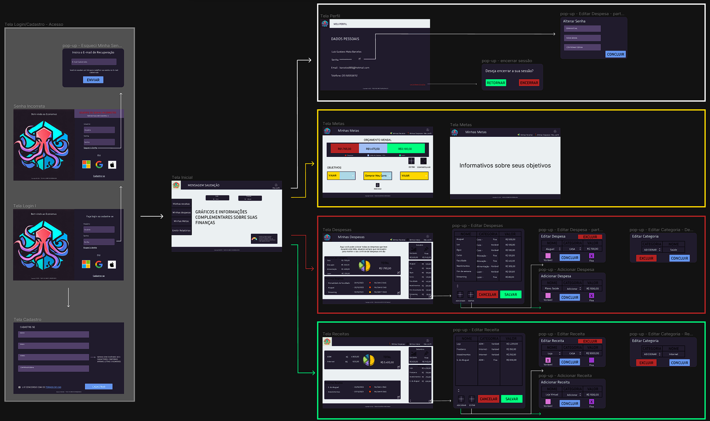
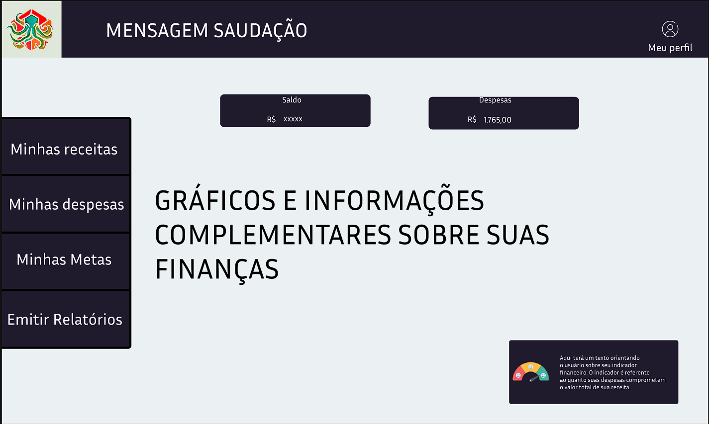
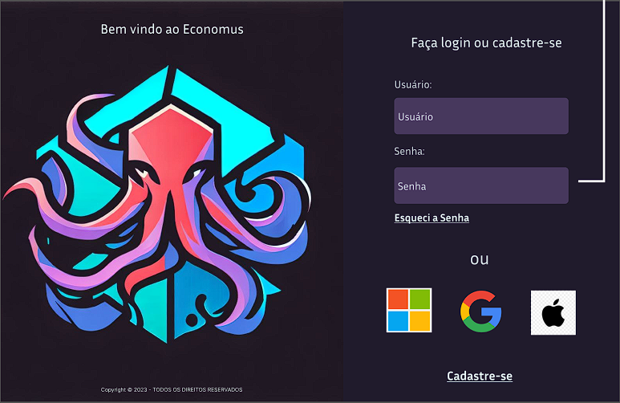
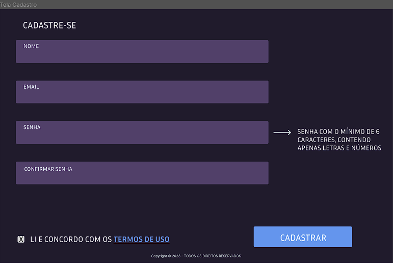
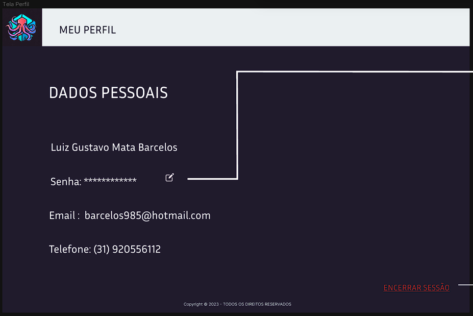
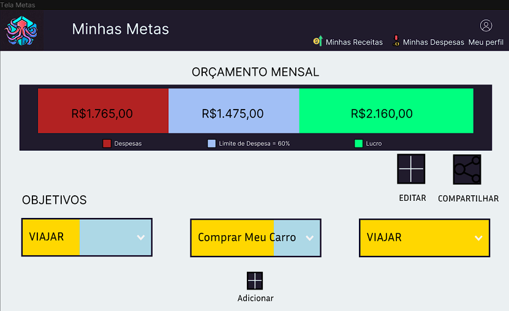
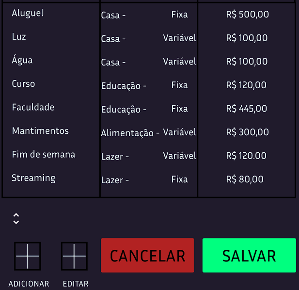
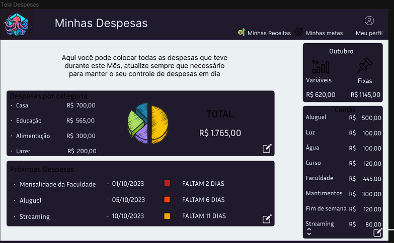
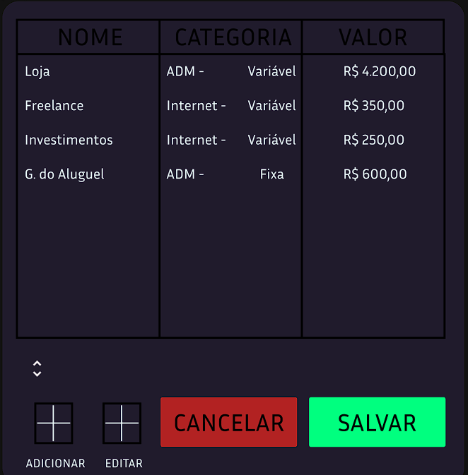
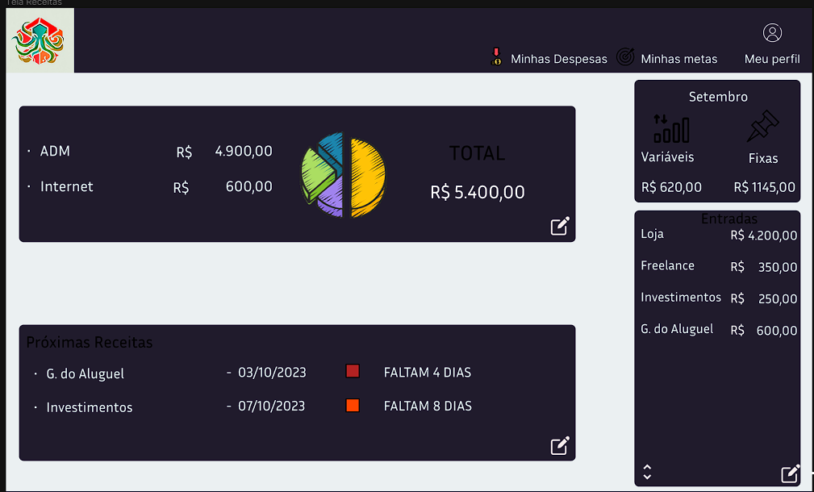

# Projeto de Interface

## User Flow

O diagrama apresentado na Figura 'userflow.png' mostra o fluxo de interação do usuário pelas telas do sistema. Cada uma das telas deste fluxo é detalhada na seção de Wireframes que se segue. Para visualizar o wireframe interativo, acesse o ambiente Figma do projeto.

  

Figura 'userflow' - Fluxo de telas do usuário

## Protótipo

### Protótipo de baixa fidelidade

---

***Tela - index (homepage)***

* **Elemento de Perfil**: Localizado no canto superior direito, exibe informações do usuário.

* **Menu Lateral Esquerdo**: Contém as opções “Minhas Receitas”, “Minhas Despesas”, “Minhas Metas” e “Emitir Relatórios”.

* **Elemento de Saldo e Despesas**: Localizado abaixo do elemento de perfil, mas centralizado, mostra o saldo e as despesas do usuário.

* **Gráfico e Informações Complementares**: Localizado no centro da página, exibe um gráfico e informações complementares.

  

Figura 'index.png' - homepage

---

***Tela - Login***

* **Logo**: Localizado centralizado à esquerda da tela.

* **Componentes de Login**: Localizados à direita, incluem campos para entrada de usuário e senha.

* **Opções de Login**: Localizadas logo abaixo dos campos de usuário e senha, oferecem a opção de login com contas da Microsoft, Google e Apple.

* **Elemento de Cadastro**: Localizado no canto inferior direito da tela, permite aos usuários criar uma nova conta.

  

Figura 'login.png' - Tela login

 ---

 ***Tela - Signup***

* **Campos do Cadastro**: Localizados no canto superior esquerdo, incluem campos para inserir nome, email, senha e confirmar senha.

* **Checkbox de Aceite dos Termos de Uso**: Localizado no canto inferior esquerdo, permite aos usuários concordar com os termos de uso antes de se registrarem.

* **Elemento de Cadastro**: Localizado no canto inferior direito, permite aos usuários finalizarem o processo de registro.

  

Figura 'signup.png' - Tela Signup

---

***Tela - Perfil***

* **Elemento Logo e Meu Perfil**: Localizados alinhados à esquerda no topo da página. O elemento “Meu Perfil” está ao lado direito do logo.

* **Dados Pessoais**: Localizado centralizado à esquerda, este componente contém campos para inserir ou editar nome, senha, email e telefone.

* **Botão ‘Encerrar Sessão’**: Localizado no canto inferior direito, permite aos usuários encerrar a sessão atual.

  

Figura 'profile.png' - Tela do Perfil

---

***Tela - Minhas Metas***

* **Componente Menu**: Localizado no topo da página, contém o logo à esquerda e o nome ‘Minhas Metas’ à direita do logo. Também inclui os elementos ‘Minhas Receitas’, ‘Minhas Despesas’ e ‘Meu Perfil’ alinhados à direita.

* **Orçamento Mensal**: Este elemento de texto está centralizado abaixo do componente menu.

* **Gráfico de Barras Empilhadas**: Localizado logo abaixo do ‘Orçamento Mensal’, este gráfico apresenta informações sobre despesas, limite de despesas e lucro.

* **Componente Editar**: Posicionado à esquerda abaixo do gráfico de barras.

* **Objetivos**: Este elemento de texto está centralizado abaixo do componente editar. Abaixo dele, há elementos que podem ser adicionados (ex.: viajar, comprar carro) pelo botão ‘Adicionar’.

  

Figura 'my-goals.png' - Tela Minhas Metas

---

***Tela - Minhas Despesas***

* **Componente Menu**: Localizado no topo da página, contém o logo à esquerda e o nome ‘Minhas Despesas’ à direita do logo. Também inclui os elementos ‘Minhas Receitas’, ‘Minhas Metas’ e ‘Meu Perfil’ alinhados à direita.

* **Texto Informativo**: Localizado logo abaixo do componente menu, este texto fornece informações pertinentes à tela.

* **Informações de Categorias e Valores**: Localizadas abaixo do texto informativo, estas informações são acompanhadas por um gráfico à direita e o valor correspondente ao lado direito do gráfico.

* **Categorias e Datas de Pagamento**: Abaixo das informações de categorias e valores, há uma lista de categorias com as respectivas datas de pagamento à direita. Ao lado direito das datas, há informações sobre quantos dias faltam para o vencimento das contas cadastradas.

* **Menu Lateral Direito**: Localizado à direita da página, abaixo do menu ‘Minhas Despesas’ e ao lado das informações de categorias e valores. Este menu contém o mês atual e, abaixo, os elementos ‘Variáveis’ e ‘Fixas’ com os respectivos valores. Abaixo desses elementos, há uma lista geral contendo as categorias à esquerda e o valor à direita. Logo abaixo à direita o componente botão 'editar'

* **Botão de Edição**: Este elemento permite aos usuários adicionar ou editar categorias de despesas. Quando clicado, ele carrega uma nova tela ou componente dentro da página atual, onde os usuários podem inserir ou alterar informações. Eles poderiam selecionar se a despesa é fixa ou variável e inserir o valor correspondente. Uma vez que as alterações estejam completas, elas poderiam ser salvas e refletidas na lista de categorias na tela “Minhas Despesas”. Esta nova tela ou componente é encerrada após o tempo de edição, retornando o usuário à tela original “Minhas Despesas”. Veja a imagem abaixo para uma representação visual do botão de edição.

  

Figura 'loss-statement-list.png' - Tela Lista de Minhas Despesas

 

  

Figura 'loss-statement.png' - Tela Minhas Despesas

---

***Tela - Minhas Receitas***

* **Componente Menu**: Localizado no topo da página, contém o logo à esquerda e o nome ‘Minhas Receitas’ à direita do logo. Também inclui os elementos ‘Minhas Despesas’, ‘Minhas Metas’ e ‘Meu Perfil’ alinhados à direita.

* **Texto Informativo**: Localizado logo abaixo do componente menu, este texto fornece informações pertinentes à tela.

* **Informações de Categorias e Valores**: Localizadas abaixo do texto informativo, estas informações são acompanhadas por um gráfico à direita e o valor correspondente ao lado direito do gráfico.

* **Categorias e Datas de Recebimento**: Abaixo das informações de categorias e valores, há uma lista de categorias com as respectivas datas de recebimento à direita. Ao lado direito das datas, há informações sobre quantos dias faltam para o recebimento das receitas cadastradas.

* **Menu Lateral Direito**: Localizado à direita da página, abaixo do menu ‘Minhas Receitas’ e das informações de categorias e valores. Este menu contém o mês atual e, abaixo, os elementos ‘Variáveis’ e ‘Fixas’ com os respectivos valores. Abaixo desses elementos, há uma lista geral contendo as categorias à esquerda e o valor à direita.

* **Botão de Edição**: Este elemento permite aos usuários adicionar ou editar categorias de receitas. Quando clicado, ele carrega uma nova tela ou componente dentro da página atual, onde os usuários podem inserir ou alterar informações. Eles poderiam selecionar se a receita é fixa ou variável e inserir o valor correspondente. Uma vez que as alterações estejam completas, elas poderiam ser salvas e refletidas na lista de categorias na tela “Minhas Receitas”. Esta nova tela ou componente é encerrada após o tempo de edição, retornando o usuário à tela original “Minhas Receitas”. Veja a imagem abaixo para uma representação visual do botão de edição.

  

Figura 'profit-statement-list.png' - Tela Lista de Minhas Receitas

 

  

Figura 'proft-statement.png' - Tela Minhas Receitas
