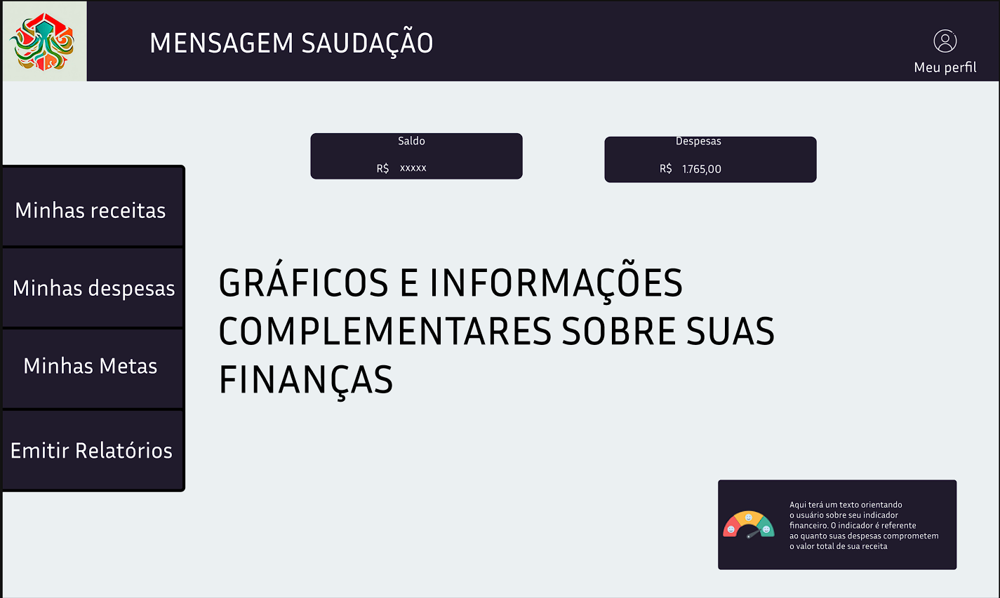
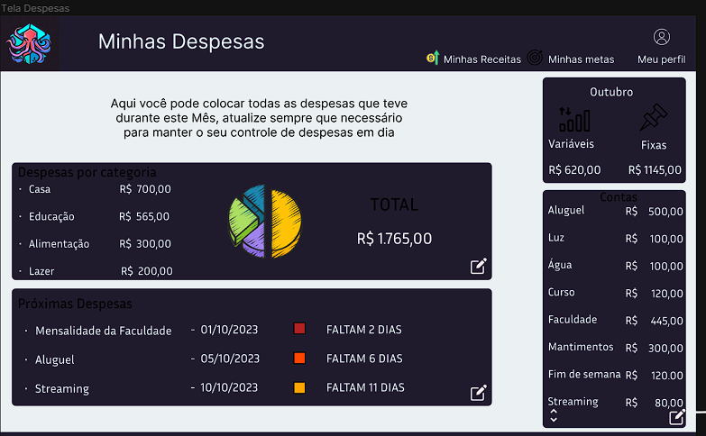

# Template padrão da Aplicação

Layout padrão do site (HTML e CSS) que será utilizado em todas as páginas com a definição de identidade visual e a linguagem de programação JavaScript foi utilizada para a construção do menu responsivo.

As páginas terão como elementos padrões o menu de navegação, o header, além dos elementos de identidade visual citados abaixo:

* **Cores:** #201823, #201b2c; 
* **Font-family:** sans-serif;
* **Font-size:** 15px e 24px;

O código utilizado para a construção dos elementos citados, incluindo a responsividade, pode ser consultado aqui. As imagens e ícones utilizados no projeto estão disponíveis aqui.

### Tela de visualização das Finanças

Exibe informações como receitas, despesas e metas.

  

Figura 'index.png' - homepage

Figura 1 - Tela Principal

### Tela de visualização das Despesas 

Exibe informações sobre as despesas, despesas por categoria e próximas despesas.

  

Figura 'loss-statement.png' - Tela Minhas Despesas

Figura 2 - Tela de Despesas

Para a criação do logotipo do site foi utilizada a cor roxo. A utilização da imagem do polvo como protetor da vida financeira fazendo uma analogia ao polvo que protege o baú do tesouro impedindo-o de ser usurpado.

  

Figura 'logo-economus.png' - Imagem Logo Economus

Figura 3 - Logotipo da aplicação web ECONOMUS
