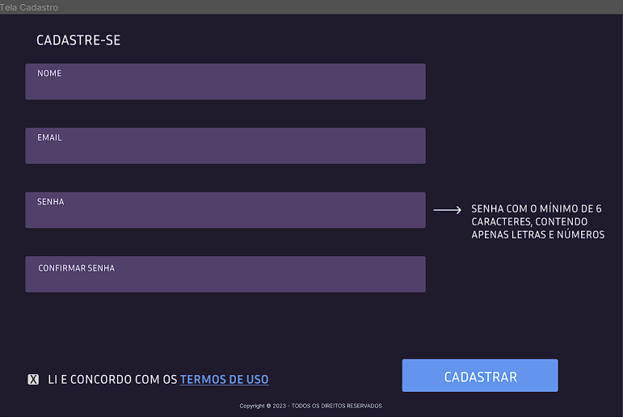
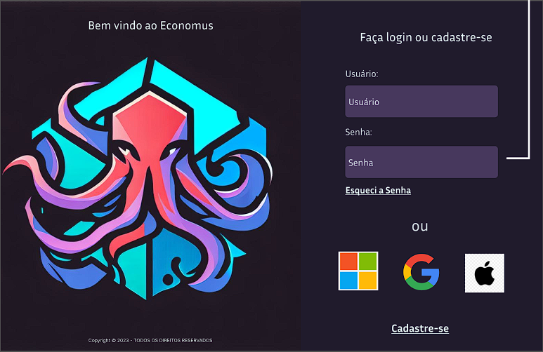

# Programação de Funcionalidades

Implementação da aplicação descritas por meio dos requisitos codificados. 

### Tela de Cadastro (RF-01)

  

#### Requisito atendido

RF-01: O site deve permitir ao usuário cadastrar uma conta.

#### Artefatos da funcionalidade

* Form.css
* cadastro.html
* cadastro.js
* error-handling.js 

#### Estrutura de Dados

* <a href= ">

#### Instruções de acesso

Abra um navegador de Internet e informe a seguinte URL:
Ao clicar em “Cadastre-se” localizado no canto inferior direito, permite aos usuários finalizarem o processo de registro.

#### Responsável

Luiz Gustavo

### Tela de Login (RF-02)

  

#### Requisito atendido

RF-02: O site deve permitir ao usuário fazer o login da sua conta.

#### Artefatos da funcionalidade

* app.js
* icone-da-pagina_resized.ico
* logo-login.png
* style.css
* tela-de-login.html

#### Estrutura de Dados

* <a href= "https://github.com/ICEI-PUC-Minas-PMV-ADS/pmv-ads-2023-2-e1-proj-web-t14-gestaofinanceira/blob/34e67f48efd11f1d2d3fce27a9dec55c98e5d572/codigo-fonte/src/user-login/tela-de-login.html">tela-de-login.html</a>

#### Instruções de acesso

Abra um navegador de Internet e informe a seguinte URL:
Ao clicar em “Entrar” no canto inferior direito da tela, terá acesso a página da HomePage.

#### Responsável

Miguel

### Tela de Despesas (RF-00)

  

#### Requisito atendido

RF-00: O site deve permitir ao usuário editar e visualizar suas despesas.

#### Artefatos da funcionalidade

* user-profit-statement.css
* user-profit-statement.html
* user-profit-statement.js 

#### Estrutura de Dados

* <a href= "https://github.com/ICEI-PUC-Minas-PMV-ADS/pmv-ads-2023-2-e1-proj-web-t14-gestaofinanceira/blob/0ce53da7870587394e889901be4d01b1d849ad60/codigo-fonte/src/user-profit-statement/user-profit-statement.html"> user-profit-statement.html</a>

#### Instruções de acesso

Abra um navegador de Internet e informe a seguinte URL: 
Ao clicar em “Minhas Despesas” localizado no topo da página, contém o logo à esquerda e o nome ‘Minhas Despesas’ à direita do logo. 

#### Responsável

Gabriel e Letícia 

